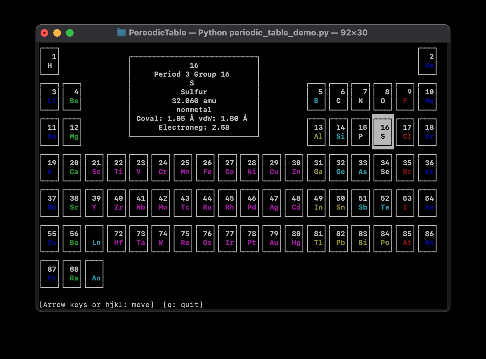

# Elements Table

**Elements Table** is a single-file Python module (`elements_table.py`) providing easy lookups of element data—atomic masses, van der Waals radii, covalent radii, electronegativities, and more—through a user-friendly API. It aims to facilitate simple, consistent access to periodic table properties in computational chemistry workflows.

## Features

- **Single-file module** for easy portability.  
- **Unified element data** from multiple sources (atomic mass, covalent/van der Waals radii, electronegativities, classification, etc.).  
- **Convenient class methods** on `Elements` (e.g., `Elements.mass("H")`, `Elements.vdw_radius("C", "pm")`) without needing to instantiate any objects.  
- **Flexible inputs**:
  - Case-insensitive element symbols (`"na"`, `"Na"`, `"NA"` all recognized as Sodium).
  - Multiple unit options for distances (`Å`, `pm`, `nm`, `bohr`, etc.) and masses (`u`, `g/mol`).
  - Bond orders (`"single"`, `"double"`, `"triple"`) for covalent radius lookups.
- **Immediate error handling** for invalid symbols or missing data (raises `KeyError`).  

---

## Installation

1. **Clone or download** this repository.  
2. Include or copy the single file `elements_table.py` in your project.  

You can import the module in your Python code like this:

```python
from elements_table import Elements

# Example usage:
atomic_num = Elements.atomic_number("Li")
print("Atomic number of Li:", atomic_num)
```

---

## API Reference

Below is a list of the class methods available in `Elements`:

1. **`Elements.is_valid(symbol: str) -> bool`**  
   - Returns `True` if `symbol` is a known element (case-insensitive), otherwise `False`.

2. **`Elements.list_symbols() -> List[str]`**  
   - Returns a sorted list of all element symbols in the internal dictionary (e.g., `["H", "He", "Li", "Be", ...]`).

3. **`Elements.atomic_number(symbol: str) -> int`**  
   - Returns the atomic number for the given element symbol (case-insensitive). Raises `KeyError` if invalid.

4. **`Elements.symbol(atomic_num: int) -> str`**  
   - Performs the reverse lookup: given an atomic number, returns the element symbol. Raises `KeyError` if not found.

5. **`Elements.name(symbol: str) -> str`**  
   - Returns the full name of the element (e.g., `"Carbon"`) for the given symbol.

6. **`Elements.mass(symbol: str, unit: str = "u") -> float`**  
   - Returns the atomic mass of the element in the requested mass unit (`"u"`, `"g/mol"`, etc.).  
   - Internally stored as atomic mass units (u). 1 u ≈ 1 g/mol.  
   - Raises `KeyError` if the unit is unrecognized or the symbol is invalid.

7. **`Elements.vdw_radius(symbol: str, unit: str = "Ang") -> float`**  
   - Returns the van der Waals radius for the element in the requested distance unit (`"Å"`, `"pm"`, `"nm"`, `"bohr"`, etc.).  
   - Internally stored in Å.  
   - Raises `KeyError` if no van der Waals radius data is available or the unit is invalid.

8. **`Elements.covalent_radius(symbol: str, order: str = "single", source: str = "cordero", unit: str = "Ang") -> float`**  
   - Returns the covalent radius for the given symbol, bond order (`"single"`, `"double"`, `"triple"`), and source (`"cordero"`, `"pyykko"`).  
   - Raises `KeyError` if the requested data is missing or invalid.  
   - Internally stored in Å.

9. **`Elements.electronegativity(symbol: str, scale: str = "pauling") -> float`**  
   - Returns the electronegativity of the element on the chosen scale (`"pauling"`, `"mulliken"`, or `"allen"`).  
   - Raises `KeyError` if no data or the scale is unrecognized.

10. **`Elements.period(symbol: str) -> int`**  
    - Returns the period number of the element (e.g., `2` for Lithium).  
    - Raises `KeyError` if the symbol is invalid.

11. **`Elements.group(symbol: str) -> int`**  
    - Returns the group number of the element (e.g., `1` for Lithium).  
    - Raises `KeyError` if the symbol is invalid.

12. **`Elements.classification(symbol: str) -> str`**  
    - Returns a string describing the classification (e.g., `"nonmetal"`, `"alkali metal"`, etc.).  
    - Raises `KeyError` if the symbol is invalid.

---

## Classifications

The `classification(symbol)` method can return one of the following categories :

- **`"nonmetal"`**  
- **`"alkali metal"`**  
- **`"alkaline earth metal"`**  
- **`"metalloid"`**  
- **`"post-transition metal"`**  
- **`"transition metal"`**  
- **`"halogen"`**  
- **`"noble gas"`**  

---

## Usage Examples

### Check if an element symbol is valid

```python
if Elements.is_valid("he"):
    print("Yes, 'He' is a valid symbol.")
```

### List all recognized symbols

```python
all_symbols = Elements.list_symbols()
print("All recognized symbols:", all_symbols)
```

### Get atomic number or symbol

```python
# Symbol -> atomic number
z = Elements.atomic_number("Fe")  # returns 26

# Atomic number -> symbol
sym = Elements.symbol(26)         # returns "Fe"
```

### Get element name or classification

```python
print(Elements.name("Na"))          # "Sodium"
print(Elements.classification("Na")) # "alkali metal"
```

### Get masses in different units

```python
# Default: returns mass in atomic mass units
hydrogen_mass_u = Elements.mass("H")  # ~1.008

# Using g/mol
hydrogen_mass_gmol = Elements.mass("H", "g/mol")  # ~1.008
```

### Distance lookups (vdW radius, covalent radius)

```python
# Van der Waals radius of Carbon in Å
c_vdw_ang = Elements.vdw_radius("C")  # ~1.7

# Convert to picometers
c_vdw_pm = Elements.vdw_radius("C", "pm")  # ~170.0
```

```python
# Covalent radius of Oxygen (single bond, pyykko scale) in bohr
o_covalent_bohr = Elements.covalent_radius("O", order="single", source="pyykko", unit="bohr")
```

### Electronegativity scales

```python
pauling_en = Elements.electronegativity("F", scale="pauling")    # 3.98
mulliken_en = Elements.electronegativity("F", scale="mulliken")  # 8.2
```

### Period and Group

```python
period_of_na = Elements.period("Na")  # 3
group_of_na = Elements.group("Na")    # 1
```

---

## Testing

A basic test suite using the built-in `unittest` framework is included at the **bottom** of `elements_table.py`. To run the tests, simply execute the module:

```bash
python elements_table.py
```

This triggers the built-in `unittest.main()`, which executes a series of checks in `TestElements`. Feel free to expand test coverage or incorporate it into a continuous integration pipeline.

---

## Demo: Terminal-Based Periodic Table

A **curses**-based Python demo script (`periodic_table_demo.py`) is included to showcase how you can use `elements_table.py` to build a **terminal-based** interactive periodic table. This demo highlights each element in the table, displays classification colors, and shows a pop-up box of data (atomic mass, covalent radius, electronegativity, etc.):

```bash
python periodic_table_demo.py
```

 

### Demo Features

- **Interactive Navigation**:  
  Use **arrow keys** to move the highlighted cell around the table. Press **q** to quit.
- **Real-Time Data**:  
  As you move the highlight, the script calls methods from `elements_table.py` (e.g., `Elements.atomic_number()`, `Elements.mass()`, `Elements.vdw_radius()`) to display up-to-date properties for the selected element.
- **Boxed Display**:  
  A separate info box in the terminal provides a short overview of each element's atomic number, mass, electronegativity, classification, etc.
- **Classifications in Color**:  
  Elements are color-coded based on whether they are alkali metals, transition metals, halogens, noble gases, etc. This color scheme uses the classification returned by `Elements.classification(symbol)`.
- **Placeholders for Lanthanides & Actinides**:  
  As an optional simplification, the f-block elements (lanthanides and actinides) are replaced with “Ln” / “An” placeholders.

### Requirements

1. **`elements_table.py`** in the same folder or installed in your Python path.  
2. A terminal that supports **curses** (most Linux and macOS terminals do).  
3. Python **3.6+** recommended (for f-strings and modern features).

### Example Usage

1. Clone this repo or copy `elements_table.py` and `periodic_table_demo.py` to your environment.
2. From a terminal with sufficient width/height (e.g., at least `24x80`), run:

   ```bash
   python periodic_table_demo.py
   ```
3. Use arrow or vi-style hjkl keys to navigate. Press **q** to exit.


## License

This project is released under the [MIT License](LICENSE.md) (or another license of your choice). See the `LICENSE.md` file for details.

